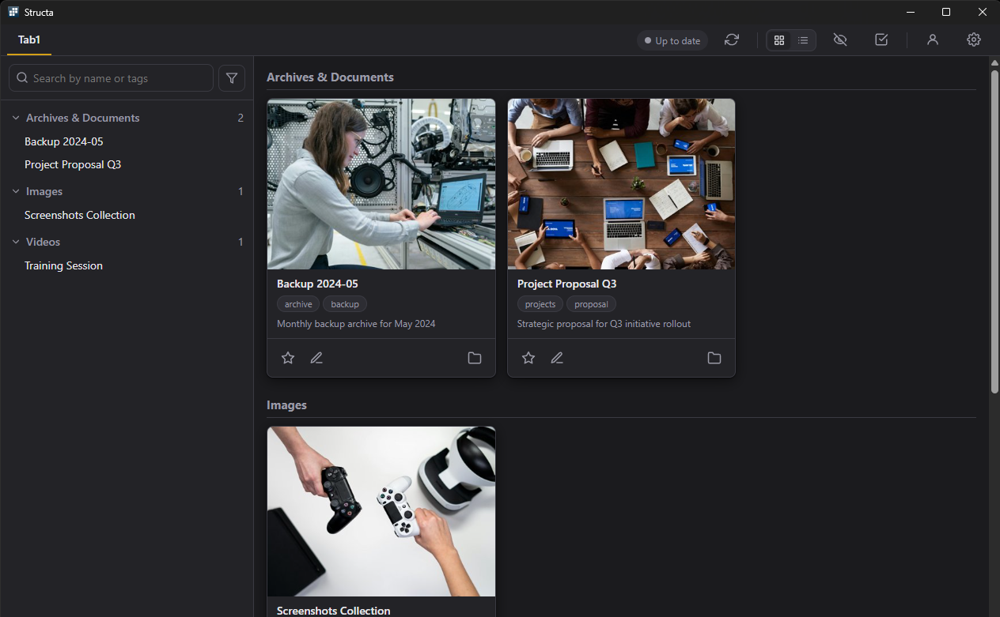

# Structa

A native desktop app for indexing and browsing libraries of folders that contain preview images and metadata. Built with [Wails v2](https://wails.io/) — Go backend + React/TypeScript frontend, packaged as a single Windows executable.

## Why this exists

Like most people, I had accumulated a sprawl of folders across drives — old project backups, reference images, downloaded packs, scanned documents, screenshots — and I could never remember *where* I had stored a given thing, only that I had it *somewhere*. File Explorer is good at showing one directory at a time; it is terrible at letting you survey a library by purpose, tag, or thumbnail. Search-by-filename is useless when you named the folder six months ago and have since forgotten the words you picked.

Structa is the tool I built to fix that for myself. The premise: keep my files exactly where they already live on disk — no central database that owns them, no copy step, no proprietary import — and lay a visual, taggable, searchable index on top. Every folder gets a thumbnail and a tiny `structa.yaml` describing what it is. The app then groups those folders into tabs and categories I choose, watches the disk so the index never goes stale, and lets me filter by tag, favorite, or free-text search until the thing I half-remembered surfaces.

It is general-purpose: any directory tree whose leaves are folders containing an image and a small `structa.yaml` will work — archives, document libraries, photo collections, design references, model packs, scanned receipts, anything. Profiles let me keep several independent libraries side by side (work / personal / a specific project) and swap between them from the topbar without losing state.



## Highlights

- **One executable** — no Python, no Node runtime on the user's machine. Uses the WebView2 runtime built into Windows 10/11.
- **Multi-profile** — each profile is just a folder you point Structa at. Catalog, config and thumbnails live in a `.structa/` sidecar inside that folder, so libraries are fully portable (copy, sync, back up). Swap profiles from the user icon in the topbar.
- **Automatic indexing** — no manual "scan" button. On launch the indexer reconciles the catalog with disk; while running, `fsnotify` watches every configured folder so adding or removing a folder updates the grid within ~500 ms.
- **Single-file per-item metadata** — `structa.yaml` holds name, tags, description, link, favorite, and hidden flags. Edit it on disk or via the in-app **Edit Item** modal.
- **On-disk thumbnail cache** — previews are resized to disk under the profile's `.structa/thumbs/` and referenced by path. The SQLite database stays small.
- **System theme** — light or dark, follows `prefers-color-scheme` (the Windows app theme setting).
- **Form-based settings** — three-column editor (Tabs → Categories → Folders) with a native folder picker. No raw JSON editing required.
- **Grid or list views** — toggle in the topbar. Grid clamps tags to 2 lines and descriptions to 3 lines; list shows every tag and up to 10 description lines on a horizontal card.
- **Hidden items** — mark items as hidden from the Edit modal; toggle the eye icon in the topbar to reveal or re-hide them in bulk.
- **Bulk mode** — checkbox icon in the topbar enables multi-select across the grid, including per-category select-all, for batch actions.
- **Tag & favorite filtering** — sidebar lists every tag with its count; click to filter. "Favorites only" lives at the top of the filter panel.
- **Manual rebuild** — a refresh button in the topbar forces a full re-scan of every configured folder, bypassing the content-hash cache.

## Usage guide

A walkthrough with screenshots — creating your first profile, configuring tabs and categories, editing items, and filtering — lives in [USAGE.md](USAGE.md).

## Per-item files

Each indexed item is a direct subdirectory of a configured category folder. Structa reads:

| File              | Effect |
|-------------------|--------|
| `structa.yaml`    | Item metadata: `name`, `tags`, `description`, `link`, `favorite`, `hidden`. All fields optional. |
| Any image file    | Any `.png` / `.jpg` / `.jpeg` / `.webp` inside the folder becomes the cover; multiple images populate the preview modal slideshow. |

### Example `structa.yaml`

```yaml
name: Project Proposal Q3
tags:
  - proposal
  - projects
description: Strategic proposal for Q3 initiative rollout
link: https://example.com/proposal
favorite: false
hidden: false
```

Searching for `proposal`, `Proposal`, or `PROPOSAL` in the sidebar will show only items whose name or `tags` contain that substring (case-insensitive). Clicking any chip on a card adds that tag to the active filter; clicking it again removes it. Folder names containing `.ignore` are skipped entirely.

### Migrating from the old format

Earlier versions used loose files (`tags.txt`, `description.txt`, `.favorite`, `link.url`, `preview1.png`). A one-shot migration script consolidates those into `structa.yaml` per folder — see the commit history around the metadata-modal release for the script.

## Where state lives

Each profile is self-contained. Picking a folder as a profile creates a `.structa/` sidecar inside it:

```
<profile-folder>/
├── .structa/
│   ├── catalog.db        SQLite index (folders + folder_details)
│   ├── config.json       Tabs / categories / folder list
│   └── thumbs/
│       └── <sha1(folder_path)>/
│           ├── thumb.jpg      (300 px cover)
│           └── preview-N.jpg  (600 px slideshow images)
├── <category-a>/
│   └── <item>/structa.yaml + image
└── ...
```

The list of known profiles and which one is active is stored under `%APPDATA%\structa\profiles.json`. Everything else — including per-profile config — lives next to the data.

For a full reindex without closing the app, click the refresh icon in the topbar. For a from-scratch rebuild including thumbnails, close the app and delete the profile's `.structa/` folder — the next launch will regenerate it.

## Building from source

### Prerequisites

- **Go** 1.23+
- **Node.js** 20+
- **Wails CLI** (install via `make wails-cli`)
- **WebView2 runtime** — already on Windows 10/11

### One-shot commands

```bash
make deps           # go mod download + npm install
make build          # produces build/bin/structa.exe
make build-installer# produces build/bin + NSIS installer
make dev            # hot-reload dev window
```

If you don't have `make` on Windows, the equivalent direct calls are:

```powershell
go install github.com/wailsapp/wails/v2/cmd/wails@latest
go mod download
cd frontend; npm install
wails build           # production
wails dev             # dev with hot reload
```

After modifying any Go method exposed on `App`, regenerate the TS bindings with `make generate` (or `wails generate module`).

## Project layout

```
structa/
├── main.go                    Wails bootstrap, /thumbs HTTP handler
├── app.go                     App struct + bound methods (GetCatalog, ToggleFavorite, ...)
├── internal/
│   ├── paths/                 Profile/.structa path helpers
│   ├── profiles/              Profile registry (profiles.json)
│   ├── config/                config.json marshal/unmarshal
│   ├── meta/                  structa.yaml read/write
│   ├── db/                    SQLite schema, migrations, queries (modernc.org/sqlite, no CGO)
│   ├── indexer/               walk → diff → process pipeline + thumbnail generation
│   └── watcher/               fsnotify with per-item debounce (two-level: category roots + item folders)
└── frontend/
    └── src/
        ├── App.tsx            Layout + tab routing + event subscriptions
        ├── views/
        │   ├── CatalogView.tsx
        │   ├── ConfigView.tsx
        │   └── ProfileView.tsx
        └── components/        Sidebar, Card, PreviewModal, EditItemModal, IndexStatusPill, ConfirmDialog, icons
```

## How auto-indexing works

1. On startup, the active profile is loaded from `profiles.json`. `paths.Resolve()` ensures the profile's `.structa/` and thumb cache exist.
2. The DB is opened (pure-Go SQLite — `modernc.org/sqlite`); `ensureColumn` migrates additive schema changes.
3. The indexer loads `config.json`, then for every `(tab → category → folder)` triple it lists direct subdirectories and compares each against the `folders` table by `(mtime, content_hash)`. Only changed item folders are enqueued onto a worker pool.
4. Per item folder, `process.go` resizes the cover (300 px) and previews (600 px) into the thumbs dir, parses `structa.yaml`, then upserts both rows.
5. fsnotify watches at two levels — the configured category roots (to catch new/removed item folders) and each item folder (to catch metadata or image changes), skipping `.structa/` itself. Events are debounced (`500 ms`) into `RescanFolder` calls.
6. The Go side emits `catalog:updated` events that the React frontend listens to (`EventsOn`), so the grid refreshes without a reload.

## Troubleshooting

- **"Create your first profile to get started"** — there are no profiles yet. Click **New Profile** to pick a folder, or **Import from folder** to attach to one that already has a `.structa/` sidecar.
- **"No tabs configured"** — open the gear icon (top right), add a tab, then a category, then a folder. The grid populates as the indexer processes the contents.
- **Card has no thumbnail** — the folder has no image file. Drop any `.png`, `.jpg`, or `.webp` into the folder.
- **Edits to `structa.yaml` don't show up** — most edits are caught by fsnotify, but on some filesystems (or after the app was offline during the change) the content-hash check can skip the folder. Click the refresh icon to force-rebuild; the button is disabled while a scan is already in progress.
- **Hidden items missing from the grid** — toggle the eye icon in the topbar to show hidden items. Hidden items are also excluded from tag and search filter counts until shown.
- **Renaming a tab/category leaves stale rows** — `Save` re-runs reconcile; orphan rows whose path no longer matches any configured folder are pruned and their thumbs deleted.
- **Network drives** — fsnotify can be unreliable on SMB/NFS shares. The startup reconcile scan still catches changes; restart the app or hit the refresh button to re-detect.

## License

Released under the [MIT License](LICENSE).
