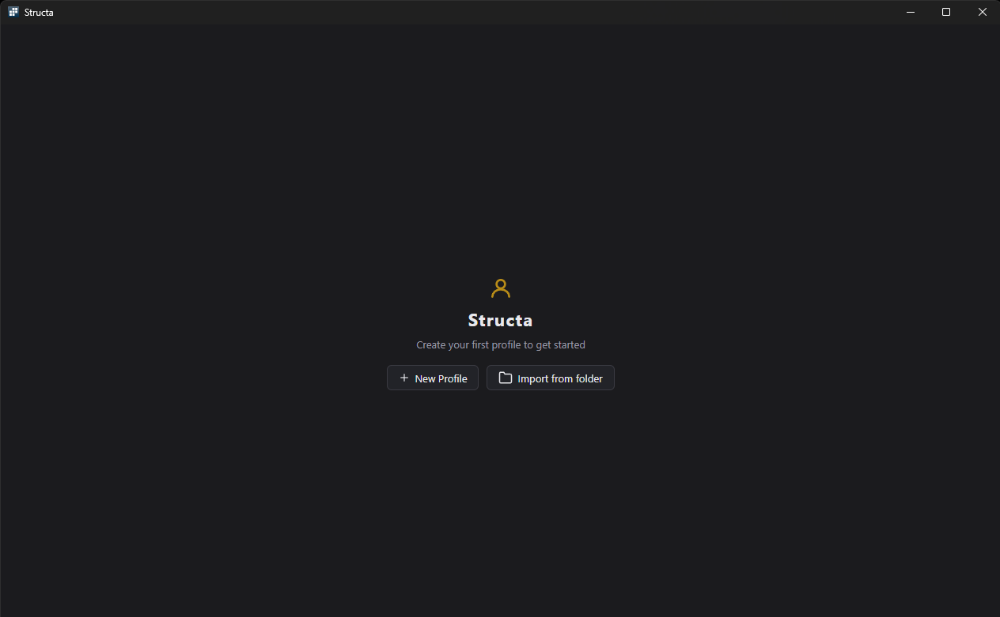
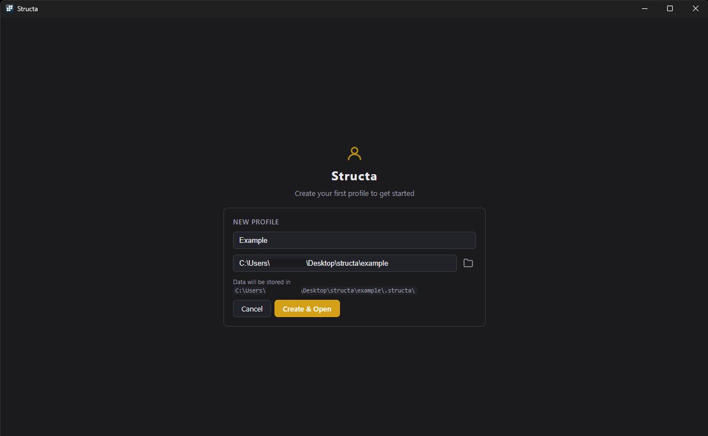
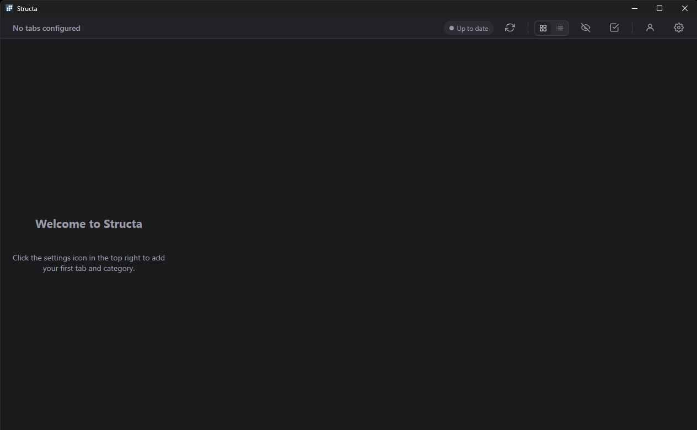
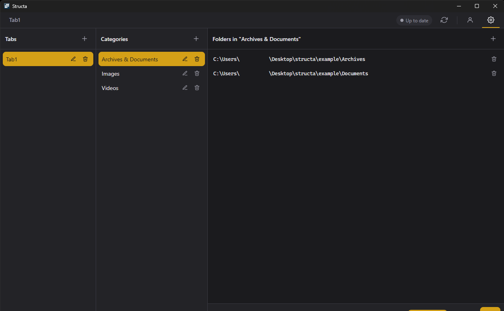
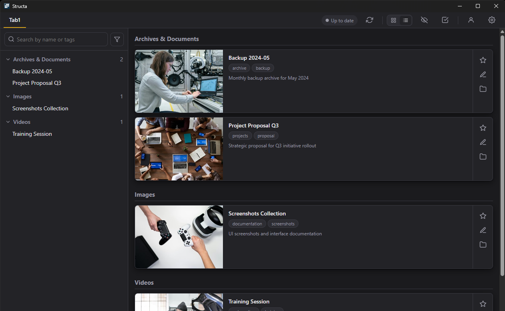
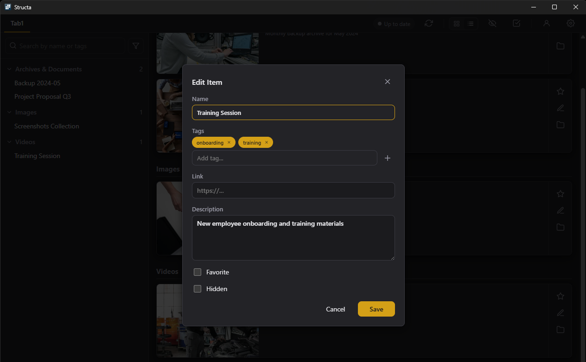
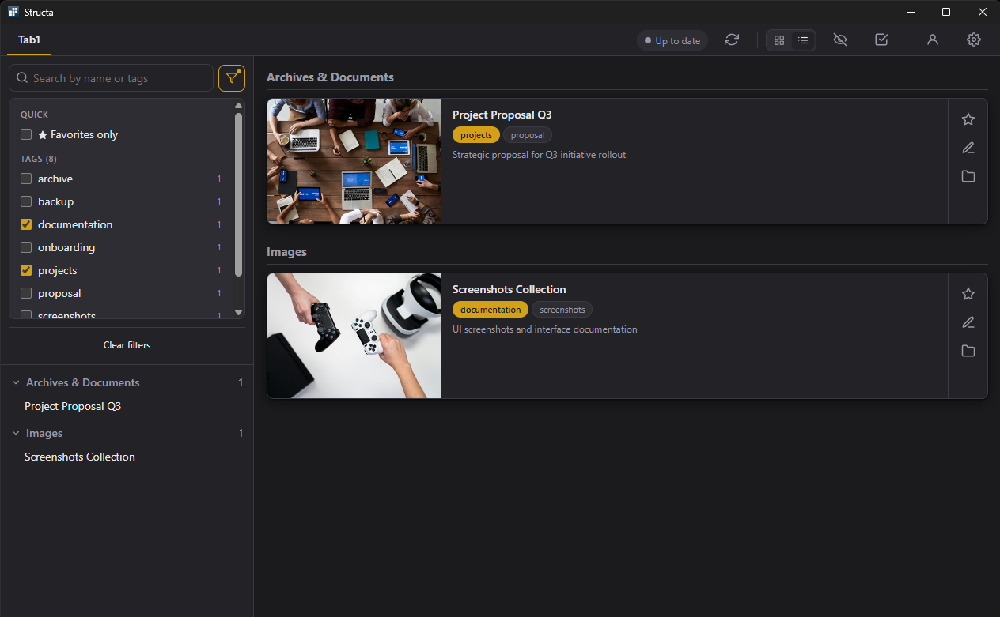

# Using Structa

A step-by-step walkthrough, from a fresh install to filtering a populated library. All screenshots are taken against the bundled `example/` directory, which you can point Structa at to follow along.

## 1. First launch

On the very first launch Structa has no profiles, so it shows the empty start screen.

You have two options:

- **New Profile** — pick an empty (or near-empty) folder that will become the root of a new library. Structa creates a `.structa/` sidecar inside it for the index, config, and thumbnail cache.
- **Import from folder** — point Structa at a folder that already contains a `.structa/` sidecar (for example, one synced from another machine or copied from a backup). The existing index is reused as-is.

## 2. Creating a profile

Clicking **New Profile** opens the create-profile form.

Fields:

- **Name** — a label that appears in the profile switcher. Free-form; rename it later if you want.
- **Folder** — the root folder for the library. Use the folder-picker button on the right.
- **Data will be stored in** — a read-only hint showing where the `.structa/` sidecar will land.

Click **Create & Open** to commit. The new profile is registered in `%APPDATA%\structa\profiles.json` and immediately becomes the active one.

## 3. The empty home screen

A brand-new profile starts with no tabs configured.

The topbar (right-hand side) is where most controls live:

- **Up to date** — the index status pill. Spins to "Scanning…" while the indexer is working.
- **Refresh** (circular arrow) — forces a full re-scan of every configured folder, bypassing the content-hash cache.
- **Grid / List** toggle — switches the catalog view.
- **Eye** — toggles visibility of items flagged as hidden.
- **Checkbox** — enters bulk-select mode for multi-item actions.
- **Profile** (person icon) — opens the profile switcher to create, import, rename, or change active profile.
- **Gear** — opens settings (tabs, categories, folders).

## 4. Configuring tabs, categories and folders

Open the gear icon to reach the three-column settings editor.

The hierarchy is **Tab → Category → Folder**:

- **Tabs** (left column) appear along the top of the catalog view. Each tab is an independent grouping — for example "Work", "Personal", "Reference".
- **Categories** (middle column) are section headings inside a tab. The example screenshot has *Archives & Documents*, *Images*, and *Videos*.
- **Folders** (right column) are the actual disk paths Structa will index for the selected category. A single category can pull from multiple folders — handy when the same kind of thing lives in more than one place.

Use the **+** button at the top of each column to add a row, the pencil to rename, and the trash icon to remove. The folder picker is a native Windows dialog. Click **Save** at the bottom to apply; Structa reconciles the catalog against the new configuration immediately.

## 5. The catalog — grid view

Once at least one folder is configured and the indexer has run, items show up grouped by category.

Each card shows:

- **Cover image** — the first image found inside the item folder. Click to open the preview modal with the slideshow.
- **Name** — from `structa.yaml` (`name:`), or the folder name as a fallback.
- **Tags** — up to two lines of chips. Click a chip to filter the catalog by that tag.
- **Description** — clamped to three lines.
- **Action row** — favorite (star), edit (pencil), open-folder (folder icon).

The sidebar on the left lists tabs you have configured plus a tree of every category and the items inside it, with counts.

## 6. The catalog — list view

Toggle the topbar to list view for a denser, horizontal layout.

List view shows every tag (no truncation) and up to ten lines of description, making it the better mode for skimming long notes or items with many tags.

## 7. Editing item metadata

Click the pencil icon on any card to open the **Edit Item** modal.

You can edit:

- **Name** — display name shown on the card.
- **Tags** — add by typing and pressing **+** (or Enter); remove with the **×** on a chip.
- **Link** — URL the globe icon will open. Useful for linking back to a source, a project page, a ticket, etc.
- **Description** — multi-line free-form text.
- **Favorite** — pin the item to the "Favorites only" filter.
- **Hidden** — exclude the item from the grid until the eye toggle is on.

Saving writes the changes back to `structa.yaml` on disk. Editing the YAML file directly in your editor of choice works too — the watcher picks it up.

## 8. Filtering by tag and favorite

Click the **filter** icon next to the sidebar search to open the filter panel.

From here you can:

- **Search by name or tags** — case-insensitive substring match across item names, configured categories, and tags.
- **Favorites only** — show only items you starred.
- **Tags** — every tag in the active profile, with a count of how many items carry it. Tick to require, untick to drop. Multiple tags compose (AND).
- **Clear filters** — reset all of the above in one click.

The catalog and sidebar tree update live to reflect the active filter — the counts on the left show how many items match per category.

---

That covers the day-to-day workflow. For background on the file format, where state lives on disk, and how the indexer works under the hood, see the main [README.md](README.md).
